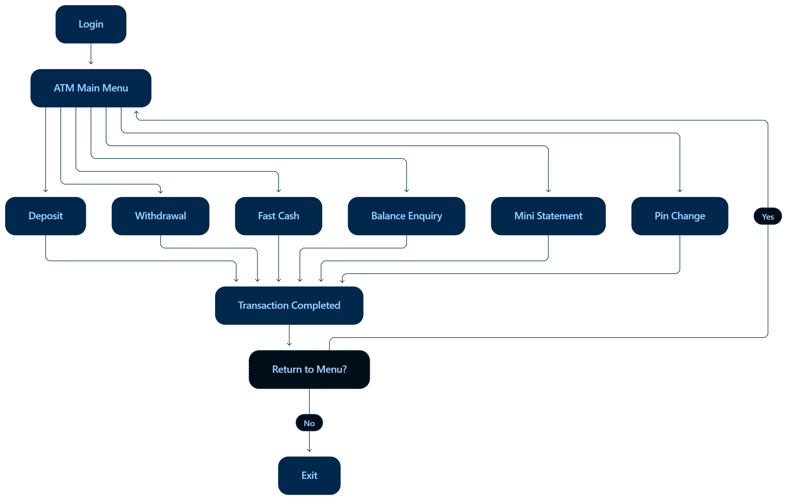
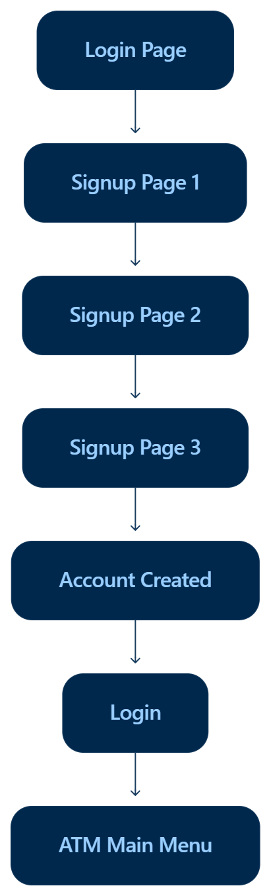
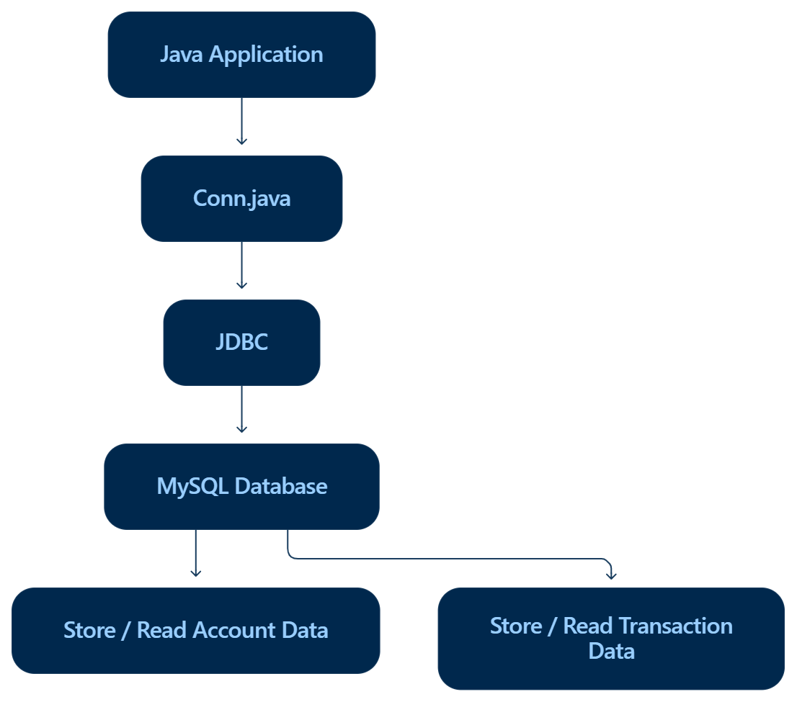

# 🏦 Bank Management System

A desktop-based Bank Management System developed using **Java Swing**, **JDBC**, and **MySQL**.

## 🛠️ Technologies Used

* Java
* Java Swing
* JDBC
* MySQL
* NetBeans
* JCalendar

## ✨ Features

* ATM-style Login Page
* User Sign Up
* Personal Details Registration
* Additional Details Registration
* MySQL Database Connectivity
* JDBC-based database operations
* Multi-page account registration
* Account details registration
* Transaction interface
 

## 🔄 Application Flow

Login
  ↓
Signin/Signup – Personal Details
  ↓
MySQL Database
  ↓
Signup Page 2
  ↓
MySQL Database
  ↓
Signup Page 3
  ↓
MySQL Database
  ↓
Transaction Page
  ↓
MySQL Database

## 📸 Screenshots

### 1. Login Page

### 2. Signup Page 1

### 3. Signup Page 2

### 4. Signup Page 3

### 5. Transactions

### 6. Deposit

### 7. Withdrawal

### 8. Fast Cash

### 9. Balance Enquiry

### 10. Mini Statement

### 11. Pin Change

## ⚙️ How to Run

1. Clone or download this repository.
2. Open the project in Apache NetBeans.
3. Configure MySQL.
4. Create the required database and tables.
5. Update the database credentials in `Conn.java`.
6. Add the required JCalendar and MySQL Connector/J libraries.
7. Run `Login.java`.
   
## 1. Main ATM System Flowchart

## 2. New Account / Signup Flow

  

## 3. Database Connection

### Flow

**Java Application → Conn.java → JDBC → MySQL Database → Account & Transaction Data**

                
